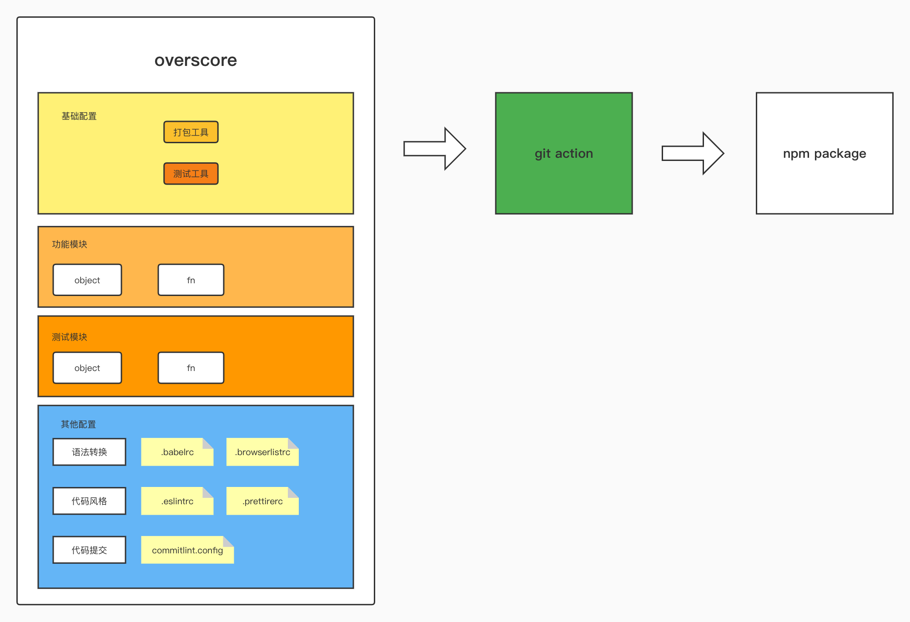

# 技术设计文档

## 1. 项目背景

​	以往接触的多个前端项目中，总是重复性的使用各种公共方法，我们可以根据日常业务开发中的这一需求，针对性的将一部分公共业务方法整合成前端工具库，以减少重复开发的成本，提高开发效率。


## 2. 技术架构设计图

​	


## 3. 功能模块拆分及人力评估	

   | 模块名                         | 责任人 | 预估人天 |
   | ------------------------------ | ------ | -------- |
   | object                         | xdh    | 1        |
   | string                         | lzhh   | 1        |
   | fn                             | zhk    | 1        |
   | 项目基础配置及 git action 配置 | chzhw  | 7        |


## 4. 目录结构


   ```
   .
   ├── CHANGELOG.md
   ├── LICENSE
   ├── README.md
   ├── commitlint.config.js
   ├── jest.config.js
   ├── package-lock.json
   ├── package.json
   ├── prettier.config.js
   ├── config
   │   └── webpack.config.js
   ├── docs
   │   ├── architecture-design.jpg
   │   └── technical-design-documentation.md
   ├── src
   │   ├── index.js
   │   └── modules
   │       ├── count
   │       │   └── add.js
   │       ├── fn
   │       │   ├── _isArray.js
   │       │   ├── _isObject.js
   │       │   ├── _typeof.js
   │       │   ├── debounce.js
   │       │   └── throttle.js
   │       └── object
   │           ├── deepClone.js
   │           ├── mergeArray.js
   │           └── mergeObject.js
   └── test
      ├── count
      │   └── add.test.js
      ├── fn
      │   ├── debounce.test.js
      │   └── throttle.test.js
      └── object
         ├── deepClone.test.js
         ├── mergeArray.test.js
         └── mergeObject.test.js
   ```


## 5. 打包方式

​	- 在 master 分支上根据版本需求，使用 npm version (patch | minor | major) 修改项目版本号

​	- 监听到版本号修改，收集 git commit 提交的信息生成 changelog，自动用 git 以 "v+版本号" 的方法打上 tag 并推送到远程仓库

​	- 远程仓库监听到以 v 开头的 tag，在 git action 中使用 webpack 将工具库以 umd 规范打包构建，并发布到 npm


## 6. 单元测试

​	单元测试工具为 jest，本项目中有两种执行测试的方式：
   - 手动执行 npm run test 命令
   - git action 中根据配置的 workflows 脚本监听指定事件，自动执行
      - 监听到 push 事件
      - 监听到 pull request 事件
      - 监听到以 v+版本号 的 tag

​	

## 7. 人力统计

   | 姓名  | 预估可参与人天 |
   | ----- | -------------- |
   | chzhw | 14             |
   | xdh   | 1              |
   | zhk   | 1              |


## 8. 小组成员及模块分配

   | 成员  | 模块                                                    |
   | ----- | ------------------------------------------------------- |
   | chzhw | 项目整体架构及工作流程设计                              |
   | xdh   | object/deepClone, object/mergeObject, object/mergeArray |
   | zhk   | fn/throttle, fn/debounce                                |

   

## 9. 里程碑划分

   | 阶段       | 内容                                         | PR 地址                                             | 责任人 |
   | ---------- | -------------------------------------------- | --------------------------------------------------- | ------ |
   | basic      | 项目基础配置完成                             | https://github.com/overscore-team/overscore/pull/14 | chzhw  |
   | github2npm | git action 中成功发布到 npm 的第一个可用版本 | https://github.com/overscore-team/overscore/pull/19 | chzhw  |
   | object     | object 模块完成                              | https://github.com/overscore-team/overscore/pull/20 | xdh    |
   | fn         | fn 模块完成                                  | https://github.com/overscore-team/overscore/pull/21 | zhk    |
   | finish     | 项目完成                                     | https://github.com/overscore-team/overscore/pull/26 | chzhw  |

